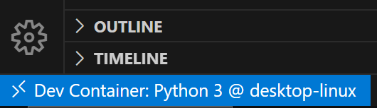

# DevRemotoVSCode

   O desenvolvimento remoto oferece benefícios como ambientes consistentes, 
   a capacidade de usar hardware mais potente e a flexibilidade de desenvolver em diferentes plataformas
   sem afetar seu computador local. O Visual Studio Code fornece ferramentas para várias
   configurações de desenvolvimento remoto, como o uso de um contêiner, um computador remoto ou
   o Subsistema do Windows para Linux (WSL). Nesse caminho, você irá:

   Saiba mais sobre as diferentes ofertas de desenvolvimento remoto disponíveis no Visual Studio Code.
   Pratique a introdução com cada oferta de desenvolvimento remoto.
   Descubra dicas para personalizar seu próprio fluxo de trabalho de desenvolvimento remoto.

# Usar um contêiner do Docker como ambiente de desenvolvimento com o Visual Studio Code

    Obter, criar e configurar um ambiente de desenvolvimento baseado em contêiner
     usando a extensão Contêineres de Desenvolvimento do Visual Studio Code.

    Objetivos de aprendizagem
    Ao final deste módulo, você saberá como:

    Instalar a extensão Contêineres de Desenvolvimento do Visual Studio Code.
    Carregar um projeto em um contêiner do Docker e se conectar com ele.
    Acessar portas no contêiner por meio do computador local.
    Personalizar as configurações enquanto trabalha com o contêiner.
    Adicionar software ao ambiente de contêiner.

# Preparar o projeto

 - Instala o Dev Container extenção do VScode

 - Baixa o repositorio do projeto !

 https://github.com/MicrosoftDocs/mslearn-python-products

# Usar a extensão Containers de Desenvolvimento no Visual Studio Code

 - A extensão Dev Containers do Visual Studio Code permite usar um contêiner 
 como um ambiente de desenvolvimento completo. É possível usar essa extensão 
 para abrir pastas ou repositórios em um contêiner e aproveitar um conjunto 
 completo de recursos do Visual Studio Code, como o IntelliSense (conclusões), 
 a navegação de código e a depuração.

# Adicionar um contêiner de desenvolvimento a um projeto existente

 ### PARTE 01

 - Aperta F1

 - Escolhe: adicionar contêiner de desenvolvimento e selecione Dev Containers: 
 adicionar arquivos de configuração de contêiner de desenvolvimento.

 - Escolhe: Python 3

 - Escolhe: 3.11

 - Aperta Ok

 - Caso não seja criada a pasta ".devcontainer" com o arquivo "devcontainer.json"
  você deve cria apasta e salvar o arquivo gerado nessa pasta que foi criada, 
  dentro do seu projeto.

 ### PARTE 02

 - Aperta F1

 - Digite: Reabrir container.

 - Selecione o "devcontainer.json" que foi gerado.

 - Espera alguns minutos até compilar.

 ### PARTE 03

 - Examine o Indicador Remoto conferindo o canto inferior esquerdo do VS Code.
  Observe que agora a mensagem "Contêiner de Desenvolvimento: Python 3" é exibida.

 

 ### PARTE 04

 - Abra um terminar, e executa o comando 

    python --version

 - A saido deve ser a versao instalado do python.

 - selecione a pasta do projeto no terminal usando dir e cd.

 - Executa o comando para instalar as dependencias do Flask, 
 é necessario para executar o projeto.

    pip3 install --user -r requirements.txt

 ### PARTE 05

 - Executa o projeto com o comando abaixo

    python app.py

 - Abra o projeto em um navegador navegando até http://127.0.0.1:5000.

# Personalizar as configurações do projeto e do editor

 - Vamos examinar as principais opções do arquivo .devcontainer/devcontainer.json
   do projeto Painel de Produtos. É um pouco trabalhoso examinar tudo de uma vez,
   então vamos dividir as opções por seção.

 ### Configuração de compilação

 - fica na opção "image" do arquivo devcontainer.json.

 - Você também pode usar arquivos conhecidos como Dockerfile ou um arquivo Docker Compose 
   para definir sua configuração. Esses arquivos podem residir na pasta .devcontainer 
   e permitir que você configure ainda mais determinados requisitos de instalação, 
   como a instalação de software adicional. Veja mais informações na documentação do contêiner de desenvolvimento.

 https://containers.dev/guide/dockerfile

 ### Configurações do projeto

 - customizations define propriedades específicas dos produtos que dão suporte 
   a contêineres de desenvolvimento, como VS Code e GitHub Codespaces.

   https://containers.dev/supporting

 - Por exemplo, você pode definir vscode.settings para copiar configurações específicas 
   do computador para o contêiner. Talvez você tenha essas definições em sua configuração do Visual Studio Code. Ao adicioná-los ao settings, você garante que as pessoas que abrirem este projeto obtenham as configurações específicas do VS Code.

 - Neste contêiner Python, você pode ver essas configurações na imagem base 
   mcr.microsoft.com/devcontainers/python:0-3.11. Eles oferecem ao usuário uma 
   experiência de edição de Python aprimorada.

 - É possível usar a matriz extensions dentro da propriedade customizations.vscode para 
   especificar quais extensões do Visual Studio Code devem ser instaladas quando conectar 
   ao contêiner. A instalação normal do Visual Studio Code e todas as extensões já instaladas 
   não estarão presentes quando você estiver usando a extensão Dev Containers. As extensões são especificadas aqui com as respectivas IDs.

 ### postCreateCommand

 - A propriedade postCreateCommand permite executar todos os comandos que você quiser após a 
   criação do contêiner.
   Lembre-se de que no primeiro exercício foi necessário executar o comando pip3 para instalar as dependências. 
   Mas como você poderia saber disso? Talvez você não soubesse. 
   É possível configurá-lo aqui para que ele seja executado automaticamente e ninguém precise se preocupar com isso.

 - No próximo exercício, você modificará o arquivo devcontainer.json para automatizar vários aspectos
  do projeto a fim de propiciar o sucesso imediato de outros desenvolvedores.

 # Personalizar as configurações do projeto e do editor

 ### Instalar extensões do Visual Studio Code

